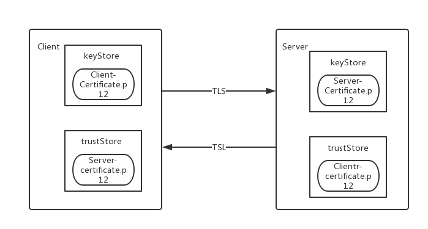
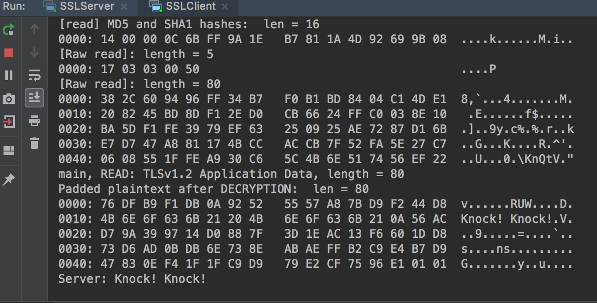

#### Simple Java SSL/TSL Socket Server 

##### 1. Qual é a função da chave pública e da chave privada.
         
* A chave pública é usada para criptografar as informações.
* A chave Privada é usada para descriptografar as informações. 

##### 2. Qual é a diferença entre assinatura digital e criptografia ?

* Ao criptografar, você usa a chave pública para escrever a mensagem e eles usam a chave privada para descriptografar e ler.
* Ao assinar, você usa sua própria chave privada para escrever a assinatura da mensagem, e eles usam sua chave pública para verificar se a mensagem é sua.

##### 3. Qual é a diferença entre keystore e truststore

* Um armazenamento de chaves possui certificados e chaves e define o que será apresentado na outra extremidade de uma conexão.
* Um truststore tem apenas certificados nele e define quais certificados que a outra extremidade enviará são confiáveis. 

##### 4. O handshake padrão para SSL / TLS

o handshake SSL padrão

1. Hello do cliente (informações de que o servidor precisa para se comunicar com o cliente usando SSL).
* Número da versão SSL
* Configuração de cifra (método de compressão)
* Dados específicos da sessão

2. Server Hello  
   * O servidor escolhe uma cifra e compressão que ele e o cliente suportam e informa ao cliente sobre sua escolha, bem como algumas outras coisas como um id de sessão.
   * Apresenta seu certificado (é o que o cliente precisa validar como sendo assinado por uma CA confiável).
   * Apresenta uma lista de DNs de autoridade de certificação pelos quais os certificados de cliente podem ser assinados.
   
3. Client response 
   * O cliente continua o protocolo de troca de chaves necessário para configurar uma sessão TLS.
   * O cliente apresenta um certificado que foi assinado por uma das CAs e criptografado com a chave pública do servidor.
   * Envie o pré-mestre (com base na cifra) criptografado pela chave pública do servidor para o servidor.
   
4. Server Accept the cert that the client presented. 
   * Server uses its private key to decrypt the pre-master secret. Both client and server perform steps to generate the master secret with the agree cipher. 
5. Encryption with Session Key.  
   * Both client and server exchange messages to inform that future messages will be encrypted. 

##### 5. Nesta demonstração simples, ele demonstra como iniciar um cliente e servidor SSL / TLS muito simples. 

* Step 1. Crie uma chave privada e um certificado público para cliente e servidor pela ferramenta openssl.

```bash
openssl req -newkey rsa:2048 -nodes -keyout client-key.pem -x509 -days 365 -out client-certificate.pem
```

```bash
openssl req -newkey rsa:2048 -nodes -keyout server-key.pem -x509 -days 365 -out server-certificate.pem
```

* Step 2. Combine a chave privada e o certificado público em `PCKS12(P12)` formato para cliente e servidor respectivamente. 

```bash
openssl pkcs12 -inkey client-key.pem -in client-certificate.pem -export -out client-certificate.p12
```

```bash
openssl pkcs12 -inkey server-key.pem -in server-certificate.pem -export -out server-certificate.p12
```

* Step 3. Coloque o `client-certificate.p12` e `server-certificate.p12` dentro de `keystore` e `trustStore` localização.

  

##### 6. Se tudo correr bem, você verá isso:

